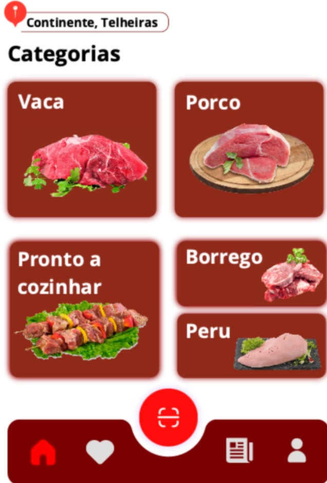

## Contexto e Problema

Um mecanismo que fornece uma barra de pesquisa ao utilizador, permitindo-lhe selecionar um supermercado específico, associado a uma determinada localização, que pode ser visualizada através da *API* do *Google Maps* e, por sua vez, outros supermercados próximos. Além disso, esta funcionalidade permite ainda selecionar uma dada categoria de carne, permitindo a visualização (e futuras operações) das diversas carnes disponíveis no mesmo.

## Decisão

Decidiu-se implementar um sistema de localização do supermercado utilizando a *API* do *Google Maps* como um *micro-frontend*, integrando ainda as categorias de carne disponíveis no supermercado selecionado, bem como os destaques da respectiva categoria selecionada.

## Justificações

Este *micro-frontend* com o *API* do *Google Maps* integrado **simplifica** a implementação da funcionalidade de localização, **reduzindo** a complexidade técnica e o tempo de desenvolvimento . Além disso, garante uma representação **precisa** das localizações dos supermercados e **facilita** a navegação para os utilizadores.

**Implementação independente:** Permite atualizações rápidas e pontuais, bem como a **reutilização**, sem afetar o funcionamento de outras áreas da *app*.

Uma **equipa dedicada** pode concentrar-se na melhoria e manutenção destas funcionalidades, tomando **decisões autónomas,** garantindo a sua eficácia.

**Serviços verticais:** A funcionalidade de localização está inerentemente ligada aos serviços relacionados a compras no supermercado. Ao integrarmos as categorias de carnes disponíveis no supermercado e os seus respectivos destaques, este *micro-frontend* oferece uma solução integrada e coesa, alinhada com a arquitetura vertical de serviços do projeto, permitindo um controlo detalhado e escalabilidade.

**Flexibilidade:** Permite ajustar e melhorar estas funcionalidades de forma independente, de forma a responder às necessidades, em constante mudança, do mercado e dos utilizadores.

## Task 2

<table>
  <tr>
    <th>Micro-frontends</th>
    <th>Views</th>
    <th>FE services</th>
  </tr>
  <tr>
    <td rowspan="18">Product</td>
    <td rowspan="3"></td>
    <td>Display Featured Products</td>
  </tr>
   <tr>
    <td>Scroll Right And Left To See More Products </td>
  </tr>
   <tr>
    <td>Details Of A Specific Product </td>
  </tr>
    <td rowspan="2"></td>
    <td>QR Code Scanning</td>
  </tr>
  <tr>
    <td>Product Details </td>
  </tr>
    <td rowspan="3"></td>
    <td>Display Product Information </td>
  </tr>
  <tr>
    <td>Display Product Details</td>
  </tr>
   <tr>
    <td>Display Product Feedback</td>
  </tr>
    <td rowspan="3"></td>
    <td>Display Product Details Information</td>
  </tr>
  <tr>
    <td>Display More Product Details</td>
  </tr>
  <tr>
    <td>Scroll Up And Down To See More Information</td>
  </tr>
   </tr>
    <td rowspan="1"></td>
    <td>Display Product Details Information</td>
  </tr>
 <td rowspan="2"></td>
    <td>Product categorization</td>
  </tr>
  <tr>
    <td>Filtering Type of Product</td>
  </tr>
</table>

