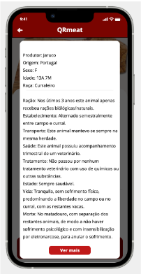

## Contexto e Problema

Um mecanismo que permite o *display* de informações relativamente ao produto, tais a sua foto, nome e preço, a secção de detalhes, bem como o botão para expandir os mesmos, que exibe a informação nutricional do mesmo. Este *display* pode ser obtido também, através de um botão que permite a leitura do *QR-Code* de um produto (se o mesmo for lido com sucesso).

Este mecanismo visa solucionar a necessidade de fornecer aos utilizadores informações detalhadas sobre um produto de forma conveniente e acessível.

## Decisão

Decidiu-se considerar o Produto como um único *micro-frontend* independente, **responsável exclusivamente** pelo *display* e pela gestão de toda a informação relativa aos produto.

## Justificações

Ter um único *micro-frontend* para consolidar todas as funcionalidades relacionadas ao produto, **simplificando** o desenvolvimento, a **manutenção** e a **reutilização** do sistema.

Atualizações ou correções relacionadas com o produto podem ser **implementadas independentemente** de outros serviços, permitindo uma maior eficiência, capacidade de resposta e controlo sobre o desenvolvimento do produto.

Uma **equipa dedicada** permite o foco total, uma maior coesão, responsabilidade clara e a rápida resolução de problemas, contribuindo para manutenção e melhoria das funcionalidades relacionadas com o produto.

Uma maior **flexibilidade** e **escalabilidade**, facilitando o ajuste e/ou a adição de novas funcionalidades.

## Task 2

<table>
  <tr>
    <th>Micro-frontends</th>
    <th>Views</th>
    <th>FE services</th>
  </tr>
  <tr>
    <td rowspan="12">Product</td>
    <td rowspan="2"></td>
    <td>QR Code Scanning</td>
  </tr>
  <tr>
    <td>Product Details </td>
  </tr>
    <td rowspan="3"></td>
    <td>Display Product Information </td>
  </tr>
  <tr>
    <td>Display Product Details</td>
  </tr>
   <tr>
    <td>Display Product Feedback</td>
  </tr>
    <td rowspan="3"></td>
    <td>Display Product Details Information</td>
  </tr>
  <tr>
    <td>Display More Product Details</td>
  </tr>
  <tr>
    <td>Scroll Up And Down To See More Information</td>
  </tr>
   </tr>
    <td rowspan="1"></td>
    <td>Display Product Details Information</td>
  </tr>
</table>
