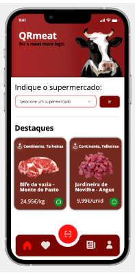
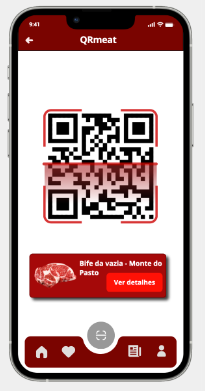
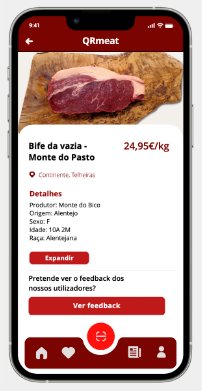

<table>
  <tr>
    <th>Micro-frontends</th>
    <th>Views</th>
    <th>FE services</th>
  </tr>
  <tr>
    <td rowspan="16">Product</td>
    <td rowspan="3"></td>
    <td>Display Featured Products</td>
  </tr>
   <tr>
    <td>Scroll Right And Left To See More Products </td>
  </tr>
   <tr>
    <td>Details Of A Specific Product </td>
  </tr>
    <td rowspan="2"></td>
    <td>QR Code Scanning</td>
  </tr>
  <tr>
    <td>Product Details </td>
  </tr>
    <td rowspan="3"></td>
    <td>Display Product Information </td>
  </tr>
  <tr>
    <td>Display Product Details</td>
  </tr>
   <tr>
    <td>Display Product Feedback</td>
  </tr>
    <td rowspan="4"></td>
    <td>Mostra dados estatísticos positivos</td>
  </tr>
  <tr>
    <td>Navegar para a página das estatística com dados negativos</td>
  </tr>
  <tr>
    <td>Navegar para a página anterior</td>
  </tr>
  <tr>
    <td>Navegar para a página do QR Code</td>
  </tr> 
</table>
