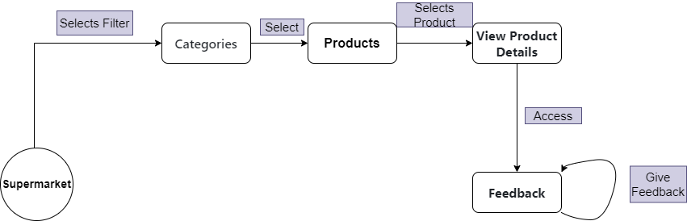

## Story 1

 A Joana sempre teve uma preocupação especial com o bem-estar dos animais e por consumir carne de forma ética. Quando descobriu o QRMeat, viu na aplicação uma oportunidade de tornar as suas escolhas alimentares mais conscientes. Ao explorar a aplicação, a Joana encontrou uma seção onde continha informação detalhada sobre vários produtos e também sobre supermercados/talhos. Depois de uma breve pesquisa, optou por um supermercado local onde continha várias carnes bem avaliadas pelos outros utilizadores.
Então a Joana deslocou-se até ao supermercado que o QRmeat indicava e fez as suas compras. Por fim, satisfeita com o estabelecimento e com a transparência e a qualidade dos produtos quando voltou para casa, enquanto preparava uma refeição, Joana decidiu deixar um breve feedback positivo no QRMeat, elogiando o supermercado por oferecer opções que respeitavam seus valores e incentivando outros utilizadores a fazerem escolhas éticas ao comprar carne. Para a Joana, usar o QRMeat não apenas facilitou a compra de carne de origem ética, mas também a fez sentir-se conectada a uma comunidade de consumidores preocupados com questões ambientais e de bem-estar animal.

## Story 2

