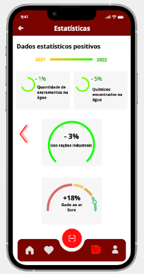

<table>
    <tr>
        <td>Micro-Frontend</td>
        <td>View</td>
        <td>FE Service</td>
    </tr>
    <tr>
        <td rowspan="9">Authentication</td>
        <td rowspan="9"></td>
    <td>LoginUser</td></tr>
    <tr><td>RegisterUser</td></tr>
    <tr><td>AuthenticateUser</td></tr>
    <tr><td>VerifyUser</td></tr>
    <tr><td>ResetPassword</td></tr>
    <tr><td>GenerateAuthToken</td></tr>
    <tr><td>InvalidateAuthToken</td></tr>
    <tr><td>SendVerificationEmail</td></tr>
    <tr><td>SendPasswordResetEmail</td></tr>
</table>

<table>
    <tr>
        <td>Micro-Frontend</td>
        <td>View</td>
        <td>FE Service</td>
    </tr>
    <tr>
        <td rowspan="12">Favourites & Feedback </td>
        <td rowspan="4"></td>
    <tr><td>RemoveFromFavourites</td></tr>
    <tr><td>GetFavouritesForUser</td></tr>
    <tr><td>SendFavouriteRemovedNotification</td></tr>
    <tr><td rowspan="8">
    <td>SubmitFeedback</td></tr> 
    <tr><td>GetFeedbackDetails</td></tr
    <tr><td>AddToFavourites</td></tr>
    <tr><td>SendfavouriteAddedNotification</td></tr>
    <tr><td>RecordFeedbackSubmission</td></tr>
    <tr><td>GenerateFeedbackReports</td></tr>
    <tr><td>SendFeedbackAcknowledgementNotification</td></tr>
    <tr><td>SendFeedbackResolvedNotification</td></tr>
</table>

<table>
  <tr>
    <th>Micro-frontends</th>
    <th>Views</th>
    <th>FE services</th>
  </tr>
  <tr>
    <td rowspan="18">Location & Filter</td>
    <td rowspan="5"></td>
    <td>Search for Supermarket</td>
  </tr>
  <tr>
    <td>Display selected supermarket </td>
  </tr>
  <tr>
    <td>Display Featured Products </td>
  </tr>
   <tr>
    <td>Scroll Right And Left To See More Products </td>
  </tr>
   <tr>
    <td>Highlights Of A Specific Product </td>
  </tr>
    <td rowspan="3"></td>
    <td>View Location on the map</td>
  </tr>
  <tr>
    <td>Product categorization</td>
  </tr>
  <tr>
    <td>Filtering Type of Product</td>
  </tr>
    <td rowspan="6"></td>
    <td>View Location and Selected Category</td>
  </tr>
  <tr>
    <td>Highlights Of A Specific Product </td>
  </tr>
   <tr>
    <td>Display Highlights Product Details</td>
  </tr>
  <tr>
    <td>Scroll Right And Left To See More Highlights Product</td>
  </tr>
  <tr>
    <td>Display All Products</td>
  </tr>
  <tr>
    <td>Scroll Right And Left To See More Products</td>
  </tr>
</table>

<table>
  <tr>
    <th>Micro-frontends</th>
    <th>Views</th>
    <th>FE services</th>
  </tr>
  <tr>
    <td rowspan="10">News&Statistics</td>
    <td rowspan="4"></td>
    <td>Show News</td>
  </tr>
  <tr>
    <td>Display News Details</td>
  </tr>
  <tr>
    <td>Navigation between News</td>
  </tr>
  <tr>
    <td>Scroll up And Down To See More Information</td>
  </tr>
    <td rowspan="2"></td>
    <td>Shows News Details</td>
  </tr>
  <tr>
    <td>Scroll up And Down To See More Information</td>
  </tr>
   </tr>
    <td rowspan="2"></td>
    <td>Present Negative Statistics On Meat Consumption</td>
  </tr>
  <tr>
    <td>Display Positive Statistics Via Side Navigation</td>
  </tr>
    <td rowspan="2"></td>
    <td>Present Positive Statistics On Meat Consumption</td>
  </tr>
  <tr>
    <td>Display Negative Statistics Via Side Navigation</td>
  </tr>
</table>

<table>
  <tr>
    <th>Micro-frontends</th>
    <th>Views</th>
    <th>FE services</th>
  </tr>
  <tr>
    <td rowspan="12">Product</td>
    <td rowspan="2"></td>
    <td>QR Code Scanning</td>
  </tr>
  <tr>
    <td>Product Details </td>
  </tr>
    <td rowspan="3"></td>
    <td>Display Product Information </td>
  </tr
  <tr>
    <td>Display Product Details</td>
  </tr>
   <tr>
    <td>Display Product Feedback</td>
  </tr>
    <td rowspan="3"></td>
    <td>Display Product Details Information</td>
  </tr>
  <tr>
    <td>Display More Product Details</td>
  </tr>
  <tr>
    <td>Scroll Up And Down To See More Information</td>
  </tr>
   </tr>
    <td rowspan="1"></td>
    <td>Display Product Details Information</td>
  </tr>
</table>

<table>
  <tr>
    <th>Micro-frontends</th>
    <th>Views</th>
    <th>FE services</th>
  </tr>
  <tr>
    <td rowspan="6">Profile</td>
    <td rowspan="6"></td>
    <td>Display user account information</td>
  </tr>
  <tr>
    <td>Supply Option For Users To Manage Their Accounts</td>
  </tr> 
   <tr>
    <td>Supply Option For Users To Contact Support</td>
  </tr> 
   <tr>
    <td>Supply Option For Users To Log Out</td>
  </tr>  
</table>
