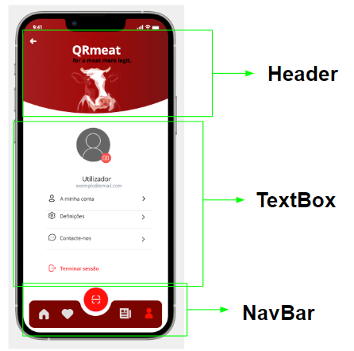

<table>
    <tr>
        <td>Views</td>
        <td>Components</td>
        <td>View models</td>
    </tr>
    <tr>
        <td rowspan="18"></td>
        <td rowspan="3">Header</td>
        <td>props.title</td>
        </tr>
        <td>props.text</td>
        </tr>
        <td>props.meatImg</td>
        </tr>
        <tr><td rowspan="8">TextBox</td>
        <td>props.textTitle</td></tr>
        </tr>
        <td>props.textEmail</td>
        </tr>
        <td>props.inputEmail</td>
        </tr>
        <td>props.TextPassword</td>
        </tr>
        <td>props.inputPassword</td>
        </tr>
        <td>props.loginButton</td>
        </tr>
        <td>props.textRegister</td>
        </tr>
        <td>props.registerButton</td>
        </tr>
</table>

<table>
    <tr>
        <td>Views</td>
        <td>Components</td>
        <td>View models</td>
    </tr>
    <tr>
        <td rowspan="18"></td>
        <td rowspan="3">Header</td>
        <td>props.title</td>
        </tr>
        <td>props.text</td>
        </tr>
        <td>props.meatImg</td>
        </tr>
        <tr><td rowspan="8">TextBox</td>
        <td>props.Icon</td></tr>
        </tr>
        <td>props.takeFoto</td></tr>
        </tr>
        <td>props.textName</td>
        </tr>
        <td>props.textEmail</td>
        </tr>
        <td>props.myAccountButton</td>
        </tr>
        <td>props.definitionsButton</td>
        </tr>
        <td>props.contactButton</td>
        </tr>
        <td>props.logoutButton</td>
        </tr>
</table>

<table>
    <tr>
        <td>Views</td>
        <td>Components</td>
        <td>View models</td>
    </tr>
    <tr>
        <td rowspan="7"></td>
        <td rowspan="2">mainView</td>
        <td>props.titleName</td>
        </tr>
        <td>props.textBox</td>
        </tr>
        <tr><td rowspan="4">Single Card</td>
        <td>props.superMarketLocation</td></tr>
        </tr>
        <td>props.meatImage</td>
        </tr>
        <td>props.meatDescription</td>
        </tr>
        </tr>
        <td>props.price</td>
        </tr>
        <tr><td rowspan="1">Card List</td>
        <td>props.cards</td></tr>
        </tr>
        <tr><td rowspan="12">
        <tr><td rowspan="2">mainView</td>
        <td>props.meatImage</td></tr>
        </tr>
        <td>props.textBox</td>
        </tr>
        <td rowspan="6">TextBox</td>
        <td>props.tittle</td>
        </tr>
        </tr>
        <td>props.price</td>
        </tr>
        <td>props.feedbackList</td>
        </tr>
        <td>props.textMenssage</td>
        </tr>
        <td>props.saveButton</td>
        </tr>
        <td>props.feedbackButton</td>
        </tr>
        <tr><td rowspan="3">Feedback Box</td>
        <td>props.feedbackIcon</td></tr>
        </tr>
        <td>props.feedbackName</td>
        </tr>
        <td>props.feedbackRating</td>
        </tr>
        <tr><td rowspan="6">
        <tr><td rowspan="1">mainView</td>
        <td>props.PopUp</td></tr>
        </tr>
        <tr><td rowspan="4">PopUp</td>
        <td>props.PopUpTitle</td></tr>
        </tr>
        <td>props.PopUpRating</td></tr>
        </tr>
        <td>props.PopUpCancelButton</td></tr>
        </tr>
        <td>props.PopUpSaveButton</td></tr>
        </tr>
        <tr><td rowspan="5">
        <tr><td rowspan="1">mainView</td>
        <td>props.PopUp</td></tr>
        </tr>
        <tr><td rowspan="3">PopUp</td>
        <td>props.PopUpIcon</td></tr>
        </tr>
        <td>props.PopUptextMenssage</td></tr>
        </tr>
        <td>props.PopUpConfirmationButton</td></tr>
        </tr>  
</table>

<table>
    <tr>
        <td>Views</td>
        <td>Components</td>
        <td>View models</td>
    </tr>
    <tr>
        <td rowspan="8"></td>
        <td rowspan="5">mainView</td>
        <td>props.image</td>
        </tr>
        <td>props.newsTitle</td>
        </tr>
        <td>props.newsDescription</td>
        </tr>
        <td>props.moreDescriptionButtom</td>
        </tr>
        <td>props.listNews</td>
        </tr>
        <tr><td rowspan="3">Single Card</td>
        <td>props.newsImage</td></tr>
        </tr>
        <td>props.newsDate</td>
        </tr>
        <td>props.newsTitle</td>
        </tr>
        <tr><td rowspan="4">
        <tr><td rowspan="3">mainView</td>
        <td>props.newsImage</td></tr>
        </tr>
        <td>props.newsTitle</td>
        </tr>
        <td>props.newsDescription</td>
        </tr>
        <tr><td rowspan="9">
        <tr><td rowspan="8">mainView</td>
        <td>props.statisticsTitle</td></tr>
        </tr>
        <td>props.statisticsTimeline</td></tr>
        </tr>
        <td>props.statisticsPercentage</td></tr>
        </tr>
        <td>props.statisticsPercentageTitle</td></tr>
        </tr>
        <td>props.statisticsPercentageGraphic</td></tr>
        </tr>
        <td>props.statisticsEmissionNumber</td></tr>
        </tr>
        <td>props.statisticsEmissionTitle</td></tr>
        </tr>
        <td>props.positiveStatisticsButton</td></tr>
        </tr>
        <tr><td rowspan="5">
        <tr><td rowspan="1">mainView</td>
        <td>props.PopUp</td></tr>
        </tr>
        <tr><td rowspan="3">PopUp</td>
        <td>props.PopUpIcon</td></tr>
        </tr>
        <td>props.PopUptextMenssage</td></tr>
        </tr>
        <td>props.PopUpConfirmationButton</td></tr>
        </tr>  
</table>
